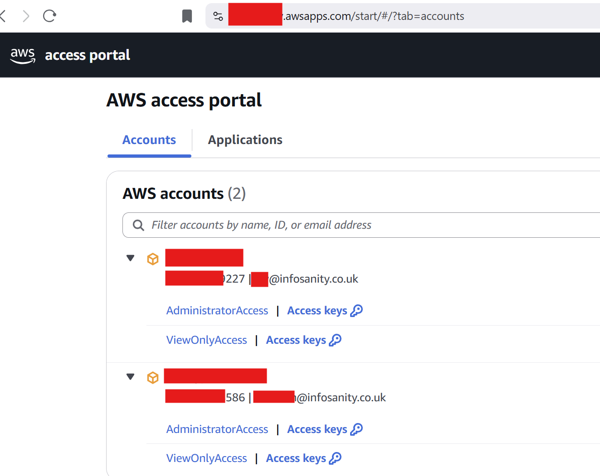

# AWS SSO Profile Builder

## Summary
Builds multi-profile configuration file after reading [Identity Centre's Access Portal](https://docs.aws.amazon.com/singlesignon/latest/userguide/using-the-portal.html), generating a profile block for each available account/role combination.



## Config File

Copy the distributed awssso.cfg-dist example, to awssso.cfg, and modify as required to your environment. The \[Profile\] block is required, the \*-mappings sections provide quality of life capabilities, as detailed below.

### Profile

*Region* and *sso_region* should be self explanatory, and dependent on your use-case. 
*Output* is personal preference, 
*sso_start_url* is the base of your existing IAM Identity Centre Setup, see [AWS Docs](https://docs.aws.amazon.com/singlesignon/latest/userguide/howtochangeURL.html) for more info if required.

### \*-mappings
The two \*-appings sections provide quality of life capabilities to translate both AWS Account names and Role names to user prefered alternatives. For example shortening the defualt **AdministratorAccess** to shorthand of just **admin**

As the generated profile names could be used many times from CLI *aws --profile <profile\-name>* type commands, shortening **MyCompanyNameDevelopmentEnvironment-AdministratorAccess** to **work-admin** will quickly save both your keystrokes and typos.

Typically run the script once to see the default output, before updating the awssso.cfg file to tweak as desired.

# Running Tool
Running the utility is relatively straightforward, typical 'make executable, and run':
```
chmod +x awssso.py
./awssso.py
```

## Example output
```
[profile work-ro]
sso_start_url = https://work.awsapps.com/start#/
sso_region = eu-west-1
region = eu-west-1
output = json
sso_account_id = 00000000227
sso_role_name = ViewOnlyAccess
```

## ~/.aws/config
Profiles need adding to your local aws config file, either in addition to your existing configuration, or replacing (depending on your needs).

If you only have profiles via the Access portal, you can simply overwrite with below 

**WARNING**: Existing configuration will be irretreviably destroyed unless you manually backup prior
```
./awssso.py > ~/.aws/config
```