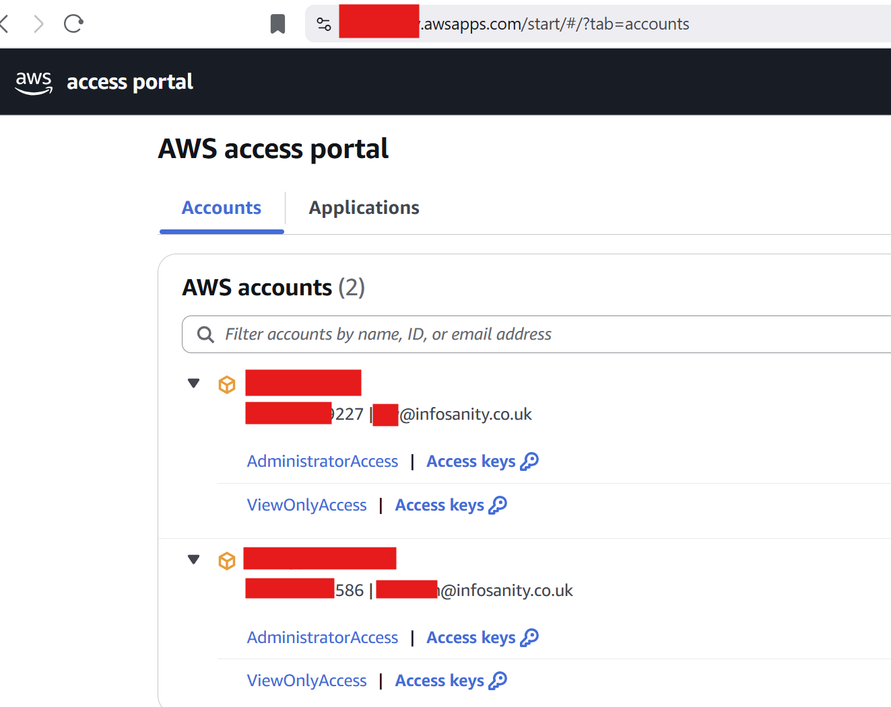

# AWS SSO Profile Builder

## Summary
Builds multi-profile configuration file after reading [Identity Centre's Access Portal](https://docs.aws.amazon.com/singlesignon/latest/userguide/using-the-portal.html), generating a profile block for each available account/role combination.



## Config File

Copy the distributed awssso.cfg-dist example, to awssso.cfg, and modify as required to your environment. Declare one `[sso-session NAME]` block per AWS Organisation; the `\*-mappings` sections provide quality of life capabilities, as detailed below.

Different config file can be provided with the --configfile parameter

### sso-session

Each `[sso-session NAME]` block describes one Organisation's IAM Identity Centre instance:

- *sso_start_url* is the base of your existing IAM Identity Centre Setup, see [AWS Docs](https://docs.aws.amazon.com/singlesignon/latest/userguide/howtochangeURL.html) for more info if required.
- *sso_region* is the region your Identity Centre is hosted in — the tool talks to the SSO API here.
- *region* and *output* control the generated profiles and can be set per session or shared via a `[defaults]` block. *Output* is personal preference.

`NAME` becomes the `sso_session` name in the generated `~/.aws/config`, and is what you pass to `aws sso login --sso-session NAME`. Because profiles reference a shared `[sso-session]`, the AWS CLI (v2.9.0+) automatically refreshes the hourly access token, so you can switch between any profile — across any configured org — without re-authenticating until the underlying portal session expires.

Multiple sessions can be logged in at once: each writes its own token file under `~/.aws/sso/cache/`, and the tool locates the correct one by matching the `startUrl` inside each cached token (not the newest file).

**Legacy format:** a single `[profile]` block (the original single-org format) is still accepted and treated as one session.

### \*-mappings
The two \*-appings sections provide quality of life capabilities to translate both AWS Account names and Role names to user prefered alternatives. For example shortening the defualt **AdministratorAccess** to shorthand of just **admin**

As the generated profile names could be used many times from CLI *aws --profile <profile\-name>* type commands, shortening **MyCompanyNameDevelopmentEnvironment-AdministratorAccess** to **work-admin** will quickly save both your keystrokes and typos.

Typically run the script once to see the default output, before updating the awssso.cfg file to tweak as desired.

# Running Tool
First log in to each configured org (once per session), then run the utility:
```
aws sso login --sso-session orga
aws sso login --sso-session orgb
chmod +x awssso.py
./awssso.py
```
Any session without a valid cached token is skipped with a warning naming the `aws sso login` command to run.

## Example output
```
[sso-session work]
sso_start_url = https://work.awsapps.com/start
sso_region = eu-west-1
sso_registration_scopes = sso:account:access

[profile work-ro]
sso_session = work
sso_account_id = 00000000227
sso_role_name = ViewOnlyAccess
region = eu-west-1
output = json
```

## ~/.aws/config
Profiles need adding to your local aws config file, either in addition to your existing configuration, or replacing (depending on your needs).

If you only have profiles via the Access portal, you can simply overwrite with below 

**WARNING**: Existing configuration will be irretreviably destroyed unless you manually backup prior
```
./awssso.py > ~/.aws/config
```